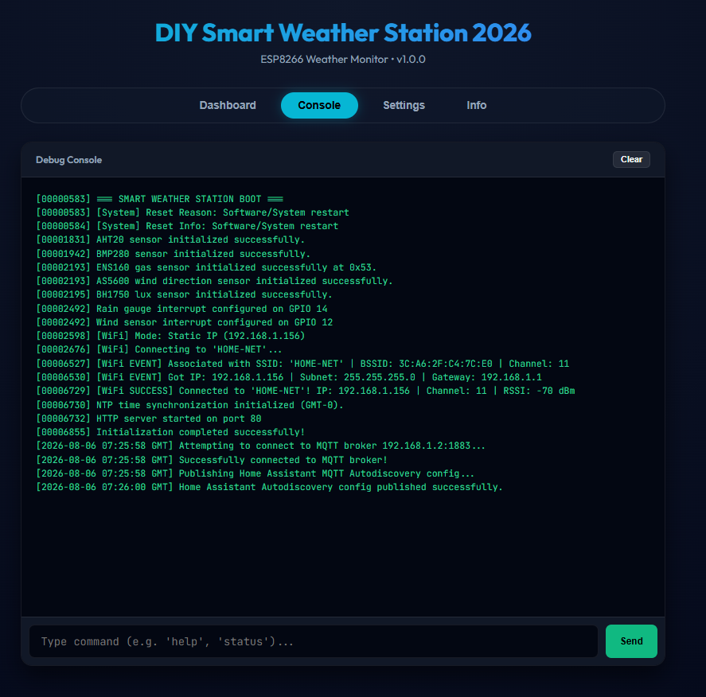
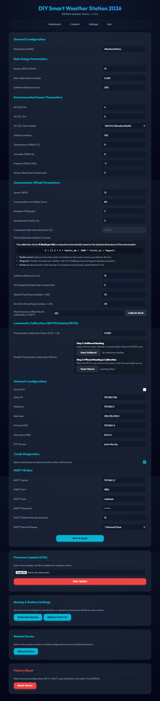
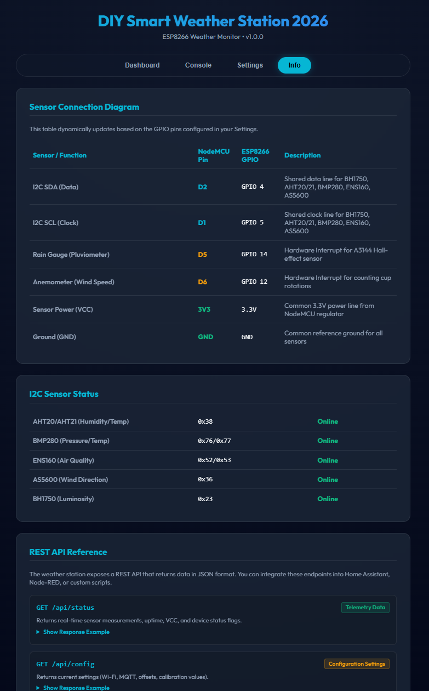
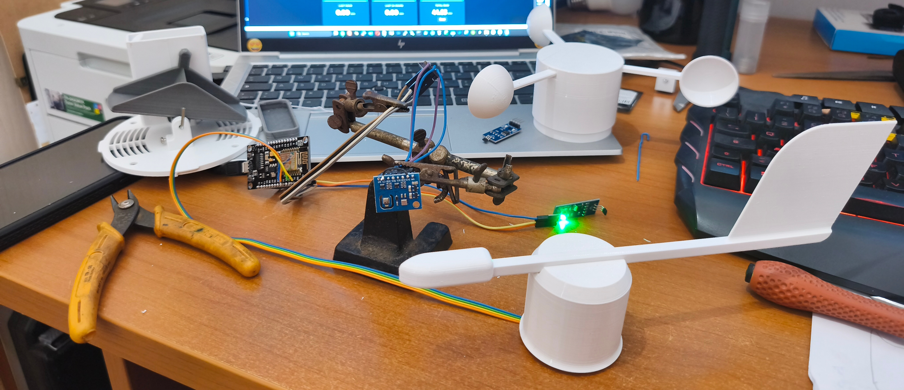
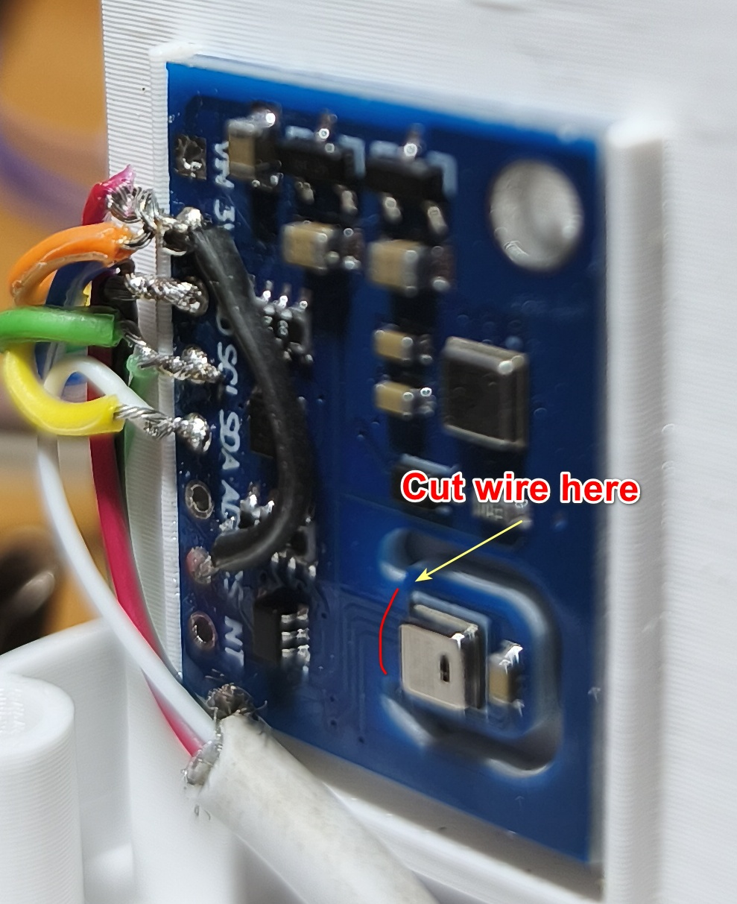

# 📸 Weather Station Photo Gallery

Click on any thumbnail image to view it in full resolution!

---

## 🖥 Web Interface Screenshots

<table>
  <tr>
    <td align="center" width="50%">
       
      <b>Web Dashboard</b>
    </td>
    <td align="center" width="50%">
       
      <b>Live Debug Console</b>
    </td>
  </tr>
  <tr>
    <td align="center" width="50%">
       
      <b>Settings & Calibration</b>
    </td>
    <td align="center" width="50%">
       
      <b>System Info Page</b>
    </td>
  </tr>
</table>

---

## 🌤 Weather Station Overview

<table>
  <tr>
    <td align="center" width="33%">
       
      <b>Fully Optioned Setup</b>
    </td>
    <td align="center" width="33%">
       
      <b>Panoramic View</b>
    </td>
    <td align="center" width="33%">
       
      <b>Weather Station Assembly</b>
    </td>
  </tr>
</table>

---

## 🗼 Sensor Tower & Mounting Structure

<table>
  <tr>
    <td align="center" width="25%">
       
      <b>Sensor Tower - View 1</b>
    </td>
    <td align="center" width="25%">
       
      <b>Sensor Tower - View 2</b>
    </td>
    <td align="center" width="25%">
       
      <b>Sensor Tower - View 3</b>
    </td>
    <td align="center" width="25%">
       
      <b>Sensor Tower - View 4</b>
    </td>
  </tr>
</table>

---

## 💨 Anemometer & Wind Vane Sensors

<table>
  <tr>
    <td align="center" width="33%">
       
      <b>AS5600 Wind Direction Vane</b>
    </td>
    <td align="center" width="33%">
       
      <b>Wind Vane Mechanism</b>
    </td>
    <td align="center" width="33%">
       
      <b>AS5600 Encoder Mounting</b>
    </td>
  </tr>
  <tr>
    <td align="center" width="33%">
       
      <b>Anemometer - View 1</b>
    </td>
    <td align="center" width="33%">
       
      <b>Anemometer - View 2</b>
    </td>
    <td align="center" width="33%">
       
      <b>Anemometer Cups & Rotor</b>
    </td>
  </tr>
</table>

---

## 🌧 Rain Gauge, Lux Sensor & Accessories

<table>
  <tr>
    <td align="center" width="33%">
       
      <b>Tipping Bucket Rain Gauge</b>
    </td>
    <td align="center" width="33%">
       
      <b>BH1750 Light Sensor</b>
    </td>
    <td align="center" width="33%">
       
      <b>Sensor Support Arm</b>
    </td>
  </tr>
</table>

---

## 🛡 Protective Covers & Environmental Housing

<table>
  <tr>
    <td align="center" width="33%">
       
      <b>Humidity Sensor Shielding</b>
    </td>
    <td align="center" width="33%">
       
      <b>Radiation Shield Cover 1</b>
    </td>
    <td align="center" width="33%">
       
      <b>Radiation Shield Cover 2</b>
    </td>
  </tr>
  <tr>
    <td align="center" width="33%">
       
      <b>Radiation Shield Cover 3</b>
    </td>
    <td align="center" width="33%">
       
      <b>Radiation Shield Cover 4</b>
    </td>
    <td align="center" width="33%">
       
      <b>Radiation Shield Cover 5</b>
    </td>
  </tr>
</table>

---

## ⚡ Electronics Enclosure & Bench Testing

<table>
  <tr>
    <td align="center" width="33%">
       
      <b>ESP8266 & Power Supply Box</b>
    </td>
    <td align="center" width="33%">
       
      <b>Power Supply Mounting Enclosure</b>
    </td>
    <td align="center" width="33%">
       
      <b>Bench Testing & Electronics Wiring</b>
    </td>
  </tr>
</table>
