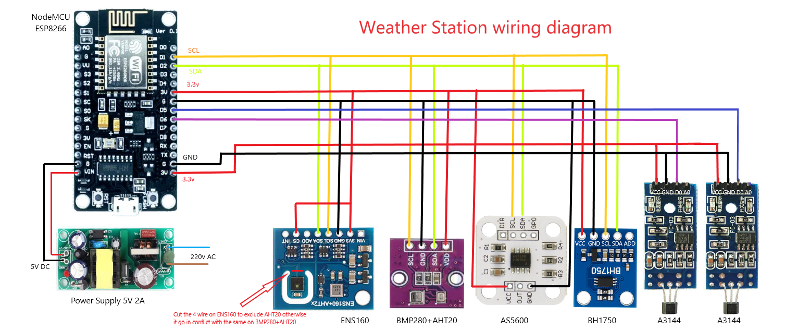

# DIY Smart Weather Station (v1.0.7)

A feature-rich, high-precision ESP8266-based Smart Weather Station with a modern responsive Web Dashboard, single-board mobile Compact UI, Timezone & Daylight Saving Time (DST) configuration, Material Design Icons (MDI), dynamic sensor detection, customizable moving-average filters, Metric & Imperial unit system support, Home Assistant MQTT Auto-Discovery, full backup/restore capability, and hardware factory reset logic.
---

> [!NOTE]
> This project was made in vibe coding using Antigravity/Gemini.
> 3D models were designed manually using Fusion360.

---

## 📋 Table of Contents

- [Features](#-features)
- [Photo Gallery](GALLERY.md)
- [Hardware Bill of Materials (BOM) & Purchase Links](#-hardware-bill-of-materials-bom--purchase-links)
- [3D Printing & Mechanical Assembly](#-3d-printing--mechanical-assembly)
- [Wiring & Pinout](#-wiring--pinout)
- [Web Interface Overview](#-web-interface-overview)
  - [Dashboard](#1-dashboard-tab)
  - [Console](#2-console-tab)
  - [Settings](#3-settings-tab)
  - [Info](#4-info-tab)
- [Settings Page Documentation](#-settings-page-documentation)
- [Home Assistant & MQTT Integration](#-home-assistant--mqtt-integration)
- [Weather Network Uploads](#-weather-network-uploads)
- [Hardware Factory Reset](#-hardware-factory-reset)
- [Backup & Restore](#-backup--restore)
- [REST API Reference](RESTAPI_REFERENCE.md)
- [Compilation & Flashing](#-compilation--flashing)
- [License & Credits](#-license--credits)

---

## ✨ Features

- **Environmental Monitoring**: Temperature, Relative Humidity, Barometric Pressure (sea-level compensated), Air Quality (TVOC, eCO2, AQI), Luminosity (lux), Wind Speed, Wind Gust, Wind Direction, and Rain Gauge (hourly, 24h rolling, and total).
- **Timezone & Daylight Saving Time (DST)**:
  - Selectable GMT/UTC offset (UTC-12 to UTC+12) and DST toggle in Settings.
  - Automatic local date & time formatting across Web Dashboard, Debug Console logs, and system tables.
  - Persisted in NVS flash memory and included in single-click JSON backup/restore.
- **Single-Board Mobile Compact UI**:
  - Unified single-container widget board (`Compact UI`) designed to fit **100% of all weather metrics on a single mobile screen without vertical scrolling**.
  - Selectable between **Classic (Spacious Cards)** and **Compact (Single-Board All-in-One)** in Settings. Saved in NVS flash memory.
- **Material Design Icons (MDI)**: Integrated crisp MDI icons across navigation tabs, dashboard cards, system tables, settings section headers, and action buttons.
- **Unit System Support (Metric & Imperial)**:
  - Toggle between **Metric** (°C, km/h, mm, hPa) and **Imperial** (°F, mph, in, inHg) in Settings.
  - Multi-unit wind speed display including **m/s (meters/sec)** and **kt (knots)** on Dashboard and MQTT.
  - Saved in NVS flash memory and included in single-click backup/restore.
- **Independent Dual-Timer Engine**:
  - Fast, dedicated timer for Anemometer pulse processing (independent of I2C read cycle).
  - Configurable I2C sensor read cycle for environmental data.
- **Configurable Moving Average (Smoothing)**:
  - **Wind Speed**: Ring buffer rolling average with configurable sample count ($N$).
  - **Wind Direction**: Circular mean calculation ($\sin$/$\cos$ vectors) preventing $0^\circ/360^\circ$ boundary glitches across $N$ samples.
  - **Instantaneous Gust Tracking**: Daily wind gust records real peak pulses before averaging.
- **Web UI & Diagnostics**:
  - Glassmorphism dark UI built with HTML5/CSS3/JavaScript (no external dependencies).
  - Tasmota-style live **Debug Console** with interactive command input.
  - Mobile-friendly IP input fields (`inputmode="decimal"`) for easy smartphone setup.
- **Network & WiFi Manager**:
  - Captive Portal AP (`WeatherStation_Setup`) for initial setup.
  - Full DHCP & Static IP configuration support (optimized for FRITZ!Box Mesh networks).
  - Soft-restart clean boot sequence ensuring stable network stack binding.
- **Home Assistant Integration**:
  - Native MQTT Auto-Discovery (`homeassistant/sensor/...`).
  - Automatic entity creation in Home Assistant without manual YAML editing.
- **Backup & Restore**: Single-click JSON export/import including full network, sensor, unit preferences, and MQTT configurations.
- **Hardware Safety & Diagnostics**: 10-second hold on FLASH button (GPIO 0) for NVS memory wipe / factory reset.

---

## 📸 Photo Gallery

Explore the complete build, sensor mounting, electronics enclosure, and web dashboard screenshots in our dedicated **[Photo Gallery (GALLERY.md)](GALLERY.md)**.

Click on any image below or in the gallery to open the full-resolution view!

<table>
  <tr>
    <td align="center" width="25%">
      <a href="images/fully_optionals_smart_wheather_station.jpg"></a><br/>
      <b>Smart Weather Station</b>
    </td>
    <td align="center" width="25%">
      <a href="images/weahet_station_dashboard.png"></a><br/>
      <b>Web Dashboard</b>
    </td>
    <td align="center" width="25%">
      <a href="images/esp%2Bpower%20box.jpg"></a><br/>
      <b>Electronics Box</b>
    </td>
    <td align="center" width="25%">
      <a href="images/Weather_station_wiring_diagram.png"></a><br/>
      <b>Wiring Diagram</b>
    </td>
  </tr>
</table>

👉 **[View Full Photo Gallery (30 Photos) ➔](GALLERY.md)**

---

## 🛒 Hardware Bill of Materials (BOM) & Purchase Links

Below is the list of hardware components required for this build, along with referral purchase links on AliExpress. For a complete, extended list including fasteners, 3D printing parameters, and recommended spare parts, see the full [Bill of Materials (BoM.md)](BoM.md).

| Component | Function / Measurement | Interface | Address / Default Pin | Purchase Link |
|---|---|---|---|---|
| **ESP8266 NodeMCU v3** (or ESP-12E) | Main Microcontroller | — | — | [🛒 Buy on AliExpress](https://s.click.aliexpress.com/e/_c35pmlcL) |
| **AHT20 + BMP280 Module** | Temp, Humidity & Pressure | I2C | `0x38` / `0x76` | [🛒 Buy on AliExpress](https://s.click.aliexpress.com/e/_c4eIj6iL) |
| **ENS160 Sensor** | Air Quality (TVOC, eCO2, AQI) | I2C | `0x53` or `0x52` | [🛒 Buy on AliExpress](https://s.click.aliexpress.com/e/_c3cfxi5h) |
| **AS5600 Magnetic Encoder** | Contactless Wind Direction Vane | I2C | `0x36` | [🛒 Buy on AliExpress](https://s.click.aliexpress.com/e/_c3MPeZFv) |
| **BH1750 Lux Sensor** | Ambient Light / Luminosity | I2C | `0x23` | [🛒 Buy on AliExpress](https://s.click.aliexpress.com/e/_c3y4FY0P) |
| **A3144 Hall Sensor** | Anemometer & Rain Bucket Pulses | GPIO Interrupt | GPIO 12 & GPIO 14 | [🛒 Buy on AliExpress](https://s.click.aliexpress.com/e/_c3e8m5mR) |
| **608Z Ball Bearings** | Low-Friction Bearings (Wind Speed & Dir) | Mechanical | — | [🛒 Buy on AliExpress](https://s.click.aliexpress.com/e/_c2JGdVCF) |
| **5V Power Supply Module** | System Power Supply | Power | 5V 1A / Vin | [🛒 Buy on AliExpress](https://s.click.aliexpress.com/e/_c43AFMgx) |
| **Counterweight** | Place inside of the weather vane | Mechanical | — | [🛒 Buy on AliExpress](https://s.click.aliexpress.com/e/_c2Q74791) |

Note: The entire system draws a maximum of 500mA. You can safely power it by harvesting the internal board of any standard 5V/1A (or higher) smartphone charger.

---

## 🖨️ 3D Printing & Mechanical Assembly

For a step-by-step mechanical assembly walkthrough and commissioning checklist, see the complete [Assembly Guide (Assembly.md)](Assembly.md).

### 🖨️ 3D Printed Models (MakerWorld)
All 3D printable STL files and print profiles for the enclosures, radiation shields, sensor arms, and mounting brackets are hosted on MakerWorld:
👉 **[Fully Optional Smart Weather Station on MakerWorld](https://makerworld.com/it/models/3139553-fully-optional-smart-weather-station#profileId-3544712)**

---

### 🌧️ Rain Gauge Modification & Calibration
The rain gauge mechanism is a modified version of the [SS4H-RG Rain Gauge Project by SmartSolutions4Home](https://smartsolutions4home.com/ss4h-rg-rain-gauge/).
- **Sensitivity Modifications**: The funnel surface area was enlarged to capture a higher volume of rainfall, significantly increasing sensor sensitivity. In addition, **2 magnets** were inserted into the tipping bucket for precise pulse triggering.
- **Calibration Procedure**:
  - You can refer to the calibration instructions in the original SS4H-RG project, or calibrate manually using water volume:
  1. Slowly pour exactly **6 ml of water** into one side of the tipping bucket.
  2. Turn the adjustment screw beneath that side until the bucket tips and drains the water.
  3. Repeat the exact same step for the opposite side of the bucket to ensure balanced tipping on both sides.

---

### ⚙️ Ball Bearing Degreasing & Lubrication (608Z Bearings)
To ensure the anemometer (wind speed) and wind vane (wind direction) turn freely even in light breezes, factory grease must be removed from the 608Z ball bearings:
1. **Isopropyl Alcohol (IPA) Bath**: Soak the bearings in Isopropyl Alcohol for **15 minutes**. Shake them, drain, and repeat with a fresh IPA bath for another **15 minutes** (2 cycles of 15 minutes total). Soaking twice for 15 minutes flushes out all heavy packing grease for optimal results.
2. **Lubrication**: Once dry and degreased, apply a few drops of light oil—such as **gun oil** or **sewing machine oil**—for ultra-low-friction rotation.

---

### 🛠️ Mechanical Assembly & Mounting Notes
- **Sensor Support Arms**: The arms holding the sensor housings must be press-fitted into the main pole mounting base with firm pressure. Use a **rubber mallet** to gently tap them into place if needed.
- **Pole Mount Diameter**: The mounting base is designed to fit standard **3/4-inch galvanized steel pipes** (tubi zincati da 3/4").
- **M8 Thread Retapping**: The M8 screw threads on the pole mount base should be chased/retapped using an **M8 thread tap tool**. Retapping cleans up the 3D-printed threads so M8 clamping bolts can be easily threaded in and tightened securely against the metal pipe, preventing the base from twisting or slipping in strong winds.
- **Counterweight**: It should be inserted inside the tip of the vane. This will prevent it from swinging too much. You can insert any weight you have available or find the weights in the BOM.

---

## 🔌 Wiring & Pinout

### 📊 Full Schematic Wiring Diagram

<p align="center">
  <a href="images/Weather_station_wiring_diagram.png"></a><br/>
  <i>Click on the diagram image to view the full high-resolution schematic</i>
</p>

Below is the recommended pin mapping for the ESP8266 NodeMCU board:

```
                  ┌──────────────────────┐
                  │   ESP8266 NodeMCU    │
                  ├──────────────────────┤
        (SDA)  D2 ┤ GPIO 4        GPIO 5 ├ D1  (SCL)
    (Rain ISR) D5 ┤ GPIO 14       GPIO 0 ├ D3  (FLASH Button - Factory Reset)
    (Wind ISR) D6 ┤ GPIO 12       GPIO 2 ├ D4  (Status LED)
                  └──────────────────────┘
```

### I2C Bus Connection (Shared SDA / SCL Pins)

Connect the **SDA** and **SCL** pins of all I2C sensors in parallel to the ESP8266:

| Sensor | Sensor VCC | Sensor GND | SDA Pin | SCL Pin | Notes |
|---|---|---|---|---|---|
| **AHT20 / AHT21** | 3.3V | GND | GPIO 4 (D2) | GPIO 5 (D1) | Address `0x38` |
| **BMP280** | 3.3V | GND | GPIO 4 (D2) | GPIO 5 (D1) | Address `0x76` or `0x77` |
| **ENS160** | 3.3V | GND | GPIO 4 (D2) | GPIO 5 (D1) | Address `0x53` or `0x52` |
| **AS5600** | 3.3V | GND | GPIO 4 (D2) | GPIO 5 (D1) | Address `0x36` |
| **BH1750** | 3.3V | GND | GPIO 4 (D2) | GPIO 5 (D1) | Address `0x23` |

**Note:** On the pressure sensor, remove the 2 resistors on SDA and SCL because when too many sensors are placed in parallel, the value of these resistors drops too much.

**Note:** On the ANS160 sensor, cut the humidity sensor tracks to avoid conflict with the one on the BMP280 sensor (they are on the same address)

<p align="center">
  
</p>

### Pulse / Interrupt Sensors

| Sensor Signal | ESP8266 Pin | Internal Pull-Up | Trigger Mode |
|---|---|---|---|
| **Rain Gauge Signal** | GPIO 14 (D5) | Yes (`INPUT_PULLUP`) | `FALLING` edge |
| **Anemometer Signal** | GPIO 12 (D6) | Yes (`INPUT_PULLUP`) | `FALLING` edge |
| **FLASH Button** | GPIO 0 (D3) | Yes (`INPUT_PULLUP`) | `LOW` when pressed |

---

## 🖥 Web Interface Overview

Access the web portal by visiting `http://<device-ip>` or `http://weatherstation.local` in any modern browser.

### 1. Dashboard Tab
- **Real-Time Cards**: Temperature (°C), Humidity (%), Pressure (hPa), Air Quality (AQI, eCO2 ppm, TVOC ppb), Wind Speed (km/h), Wind Gust (km/h), Wind Direction (° and cardinal points), Luminosity (lx).
- **Rain Monitor**: Last hour rain (mm), Last 24-hour rolling rain (mm), Total cumulative rain (mm) with a manual Reset button.
- **Rain Status Badge**: Dynamic indicator ("No Rain" / "Raining!").
- **System Information Table**: Live NTP synchronized time, Wi-Fi SSID, RSSI, IP address, uptime, total bucket tips, VCC voltage, and free RAM heap.

### 2. Console Tab
- Live streaming log output (Tasmota style).
- Interactive input bar for sending system debug commands (e.g., `help`, `status`).
- One-click log buffer clearing.

### 3. Settings Tab
- Full device configuration form divided into logical sections.
- Integrated **Transmission Calibration Wizard** for PETG luminosity filters.
- One-click **North Direction Calibration** for the AS5600 wind vane.
- Backup & Restore configuration controls.

### 4. Info Tab
- Complete hardware diagnostic summary, firmware version (`v1.0.0`), build details, and active driver states.

---

## ⚙ Settings Page Documentation

Every field on the **Settings** page is detailed below:

### ⚙ General Configuration
- **Hostname (mDNS)**: Device network identifier (default: `WeatherStation`). Accessible at `http://<hostname>.local`.

### 🌧 Rain Gauge Parameters
- **Sensor GPIO (A3144)**: GPIO pin assigned to the rain tipping bucket interrupt (default: `14`).
- **Rain Calibration (mm/tip)**: Millimeters of rain represented by a single bucket tip (default: `0.6314`).
- **Software Debounce (ms)**: Minimum elapsed time required between pulse interrupts to prevent mechanical bounce (default: `300`).

### 🌡 Environmental Sensor Parameters
- **I2C SDA Pin**: GPIO pin assigned to I2C Data (default: `4`).
- **I2C SCL Pin**: GPIO pin assigned to I2C Clock (default: `5`).
- **I2C SCL Clock Speed**: Selectable bus frequency (`50 kHz`, `100 kHz Standard`, `400 kHz Fast`).
- **Altitude (meters)**: Station elevation above sea level in meters used for barometric pressure sea-level adjustment (default: `0`).
- **Temperature Offset (°C)**: Calibration offset applied to temperature readings (e.g., `-1.5`).
- **Humidity Offset (%)**: Calibration offset applied to relative humidity readings.
- **Pressure Offset (hPa)**: Calibration offset applied to barometric pressure readings.
- **Sensor Read Interval (seconds)**: Polling interval for I2C environmental sensors, BH1750, and AS5600 wind direction (default: `5`).

### 💨 Anemometer (Wind) Parameters
- **Sensor GPIO**: GPIO pin assigned to the anemometer pulse interrupt (default: `12`).
- **Anemometer Arm Radius (mm)**: Physical distance from the rotation axis to the center of an anemometer cup (default: `80`).
- **Number of Magnets**: Number of pulses generated per full $360^\circ$ rotation (default: `1`).
- **Aerodynamic Factor (p)**: Ratio between linear wind velocity and cup rotation speed (default: `3.0`).
- **Computed Calibration (km/h per Hz)**: Read-only live field calculated as:
  $$K = \frac{7.2 \times \pi \times \text{Radius (mm)} \times p}{1000 \times \text{Magnets}}$$
- **Software Debounce (ms)**: Interrupt debounce time for wind pulses (default: `15`).
- **Wind Speed Sample Interval (seconds)**: Independent polling interval for counting anemometer pulses (default: `2`).
- **Speed Smoothing (samples, 1–60)**: Number of consecutive samples ($N$) averaged in the rolling speed buffer (default: `5`).
  $$\text{Speed Averaging Window} = N_{\text{speed}} \times \text{Wind Speed Sample Interval}$$
- **Direction Smoothing (samples, 1–60)**: Number of samples ($N$) averaged using circular vector mathematics ($\sin$/$\cos$) (default: `5`).
  $$\text{Direction Averaging Window} = N_{\text{dir}} \times \text{Sensor Read Interval}$$
- **Wind Direction Offset (0–359°)**: Software offset for North alignment. Click **Calibrate North** while pointing the wind vane physically North to automatically store the offset.

### 💡 Luminosity Calibration (BH1750 behind PETG)
- **Transmission Calibration Factor (0.01 – 1.0)**: Light transmission ratio through the PETG enclosure cover (default: `1.0`).
- **Guided Transmission Calibration Wizard**:
  1. **Step 1**: Expose BH1750 directly to a constant light source without cover, then click **Read Unfiltered**.
  2. **Step 2**: Place the PETG cover back over the sensor under the same light source, then click **Read Filtered**. The calibration factor is calculated automatically.

### 🌐 Network Configuration
- **Use DHCP**: Toggle between automatic IP assignment (DHCP) and Static IP mode.
- **Static IP / Gateway / Netmask**: Network IP settings (recommended when operating behind FRITZ!Box Mesh repeaters).
- **Primary / Secondary DNS**: Domain Name System servers (default: `8.8.8.8` / `8.8.4.4`).
- **NTP Server**: Network Time Protocol server for clock synchronization (default: `pool.ntp.org`).

### 🩺 Crash Diagnostics
- **Send crash dump**: Enables automated diagnostic crash reports upon system panic or unexpected watchdog resets.

### 📡 MQTT Broker
- **MQTT Server / Port**: IP address or hostname and port of your MQTT broker (e.g., Home Assistant Mosquitto on `192.168.1.50:1883`).
- **MQTT User / Password**: Authentication credentials.
- **MQTT Publish Interval (seconds)**: Telemetry publishing interval (default: `15`).
- **MQTT Decimal Places**: Decimal rounding for published sensor payloads (`0`, `1`, or `2`).

---

## 🏡 Home Assistant & MQTT Integration

### Auto-Discovery
When configured with a valid MQTT broker, the weather station automatically publishes Home Assistant MQTT Discovery configuration messages under:
```
homeassistant/sensor/<hostname>_<sensor>/config
homeassistant/binary_sensor/<hostname>_is_raining/config
```

All entities are automatically grouped under a single Home Assistant Device named **WeatherStation** (or your custom hostname).

## 🌐 Weather Network Uploads

The station can upload calibrated outdoor observations directly to Weather Underground, PWSWeather, CWOP, Weathercloud, Windy Stations, AWEKAS, and Belgium's WOW network. All services are disabled by default. Weather Underground, PWSWeather, and WOW-BE use WU-family protocols; CWOP uses APRS packets over APRS-IS; Weathercloud and Windy use service-specific HTTPS APIs; AWEKAS uses its legacy direct-link protocol.

Configure each service under **Settings → Weather Services**:

Only destinations selected with the compile-time flags in
**Compilation & Flashing → Selecting weather-network upload services** are
included in the firmware or shown on this page. Upload services remain
disabled by default at runtime even after they are compiled.

1. Register a station with the destination service.
2. Enter the station ID and service-specific station/API key.
3. Select an upload interval from 60 to 3600 seconds.
4. Enable the service and save the configuration.
5. After the restart, use **Queue Test Upload** and check the device console or `/api/weather_services/status`.

Uploads include temperature, humidity, calculated dew point, sea-level pressure, wind speed and direction, the rolling 10-minute gust, last-hour rainfall, and rainfall since local midnight. Destination protocols require imperial units; conversions are performed only in the uploader and do not change the dashboard unit setting.

The 10-minute gust and since-midnight rain values are maintained in an upload-only tracker. It starts only when a weather upload service is enabled (or a test upload is requested) and does not alter the station's existing dashboard, MQTT payload, daily gust, rolling rain, or counter-reset behavior.

### CWOP setup

1. [Request a CWOP station ID from NOAA](https://madis.ncep.noaa.gov/cwop_signup.shtml) before enabling uploads.
2. Enter the registered station ID and exact decimal latitude/longitude.
3. Leave the passcode at `-1` for a non-ham CWOP ID. Amateur-radio APRS stations must enter their APRS-IS passcode.
4. Keep the default `cwop.aprs.net` server and port `14580` unless CWOP support directs otherwise.
5. Use an interval of at least 300 seconds. The default is five minutes.

The CWOP packet includes last-hour (`r`), rolling-24-hour (`p`), and since-midnight (`P`) precipitation values. Packets advertise the station as non-messaging because this unattended device cannot answer APRS messages.

### Weathercloud setup

1. Create a device in Weathercloud and select compatible/custom weather software.
2. Enter its device ID (`WID`) and device key.
3. Keep the default 600-second interval. Free accounts are rate-limited to one update every 10 minutes.

Weathercloud receives metric values in its required fixed-point representation. The uploader sends current wind as `wspd` and the tracked 10-minute gust as `wspdhi`; it does not claim a 10-minute average that the station does not calculate.

### Windy setup

1. Create a station at Windy Stations and copy its short station ID and station password.
2. Enter both values under **Windy Stations**.
3. Keep the default 300-second interval; Windy throttles updates sent more often than every five minutes.

This integration targets `https://stations.windy.com/api/v2/observation/update`, the API introduced in 2026, rather than the retiring legacy endpoint. The station password is carried in a Bearer authorization header, not in the URL. Windy's `precip` field is the last-hour accumulation, so the uploader maps the existing rolling one-hour rain value rather than daily rain.

### AWEKAS setup

1. Register the station at AWEKAS and enter the account username and password.
2. Enter the station's exact decimal latitude and longitude.
3. Keep the default 300-second interval; AWEKAS requests no more than one upload every five minutes.

The 25-field direct-link payload follows the current WeeWX AWEKAS implementation. Unsupported radiation, UV, brightness, sunshine, soil-temperature, and instantaneous rain-rate fields remain empty instead of being filled with misleading values.

> [!CAUTION]
> AWEKAS currently documents a plain-HTTP upload endpoint. The protocol sends an MD5 password hash in the URL; that hash is replayable and neither it nor the weather data is protected in transit. Use a unique AWEKAS password and enable this service only on a network where that risk is acceptable.

### WOW-BE setup

1. Register a station at the Royal Meteorological Institute of Belgium's WOW site.
2. Enter the site's ID and authentication key.
3. Use a 60- to 3600-second interval; the default is five minutes.

Uploads use `https://wow.meteo.be/api/v2/send` with WOW-BE's `siteid` and `siteAuthenticationKey` fields. The formatter omits solar radiation and gust direction because this firmware does not currently produce those observations.

> [!WARNING]
> A full configuration backup contains Wi-Fi, MQTT, and weather-service credentials. Store backup files securely. The ordinary `/api/config` response does not expose weather-service keys.

### Telemetry Topics
- **Telemetry Payload**: Published to `tele/<hostname>/SENSOR`
- **Last Will & Testament (LWT)**: Published to `tele/<hostname>/LWT` (`Online` / `Offline`)

### Example JSON Payload (`tele/WeatherStation/SENSOR`)
```json
{
  "uptime": 8420,
  "heap": 24150,
  "tips": 14,
  "total_rain_mm": 8.84,
  "hourly_rain_mm": 1.26,
  "daily_rain_mm": 3.78,
  "is_raining": false,
  "rssi": -62,
  "ip": "192.168.1.150",
  "temperature": 22.4,
  "humidity": 55.1,
  "pressure": 1014.2,
  "tvoc": 45,
  "eco2": 412,
  "aqi": 1,
  "lux": 1420.5,
  "wind_speed": 12.4,
  "wind_gust": 24.8,
  "wind_direction": 184.5
}
```

---

## 🔘 Hardware Factory Reset

If you lose access to the web portal or misconfigure the network settings, you can wipe the internal NVS flash storage without reflashing firmware:

1. **Press and hold** the **FLASH button** (GPIO 0 / D3) on the NodeMCU board.
2. Hold it down for **10 continuous seconds**.
3. The onboard blue LED will flash rapidly and the console will output:
   `[System] Factory Reset triggered via FLASH button!`
4. All stored settings will be erased, and the ESP8266 will reboot automatically into Access Point captive portal mode (`WeatherStation_Setup`).

---

## 💾 Backup & Restore

### Downloading Backup
1. Navigate to **Settings** $\rightarrow$ **Backup & Restore Settings**.
2. Click **Download Backup**.
3. A JSON file named `<hostname>_config_YYYY-MM-DD.json` will download immediately, containing all sensor parameters, offsets, network choices, static IP values, and stored WiFi credentials.

### Restoring Backup
1. Click **Restore Backup** and select your saved `.json` file.
2. Confirm the prompt.
3. Settings will be restored to NVS flash and the station will reboot automatically within 8 seconds.

---

## 📡 REST API Reference

The weather station exposes **17 HTTP REST API endpoints** for querying live sensor telemetry, modifying configuration parameters, triggering sensor calibration wizards, executing interactive console commands, and integrating into third-party automation systems (Home Assistant, Python scripts, cURL, etc.).

👉 **[View Complete REST API Documentation & Integration Examples (RESTAPI_REFERENCE.md)](RESTAPI_REFERENCE.md)**

---

## 📦 Compilation & Flashing

This project is built using [PlatformIO](https://platformio.org/).

### Prerequisites
- Visual Studio Code with PlatformIO IDE extension installed.

### PlatformIO Configuration (`platformio.ini`)
```ini
[env:nodemcuv2]
platform = espressif8266
board = nodemcuv2
framework = arduino
monitor_speed = 115200
board_build.flash_mode = dout
lib_deps =
    bblanchon/ArduinoJson@^7.0.0
    knolleary/PubSubClient@^2.8
    adafruit/Adafruit AHTX0@^2.0.5
    adafruit/Adafruit BMP280 Library@^2.6.8
    https://github.com/tzapu/WiFiManager.git
```

### Selecting weather-network upload services

Weather-network uploaders are excluded by default. Enabling a service in the
web interface is not enough by itself: the corresponding uploader must first
be included at compile time with a `build_flags` entry in `platformio.ini`.

Available flags:

| Destination | Build flag |
|---|---|
| Weather Underground | `WEATHER_UPLOAD_WUNDERGROUND` |
| PWSWeather | `WEATHER_UPLOAD_PWSWEATHER` |
| CWOP / APRS-IS | `WEATHER_UPLOAD_CWOP` |
| Weathercloud | `WEATHER_UPLOAD_WEATHERCLOUD` |
| Windy Stations | `WEATHER_UPLOAD_WINDY` |
| AWEKAS | `WEATHER_UPLOAD_AWEKAS` |
| WOW-BE | `WEATHER_UPLOAD_WOW_BE` |

For example, a CWOP-only build uses:

```ini
[env:nodemcuv2]
; existing settings remain here
build_flags =
    -DWEATHER_UPLOAD_CWOP=1
```

To compile multiple destinations, add one line for every service. Do not join
names on one `-D` line. This example includes Weather Underground, CWOP, and
Windy while leaving every other uploader out of the firmware:

```ini
[env:nodemcuv2]
; existing settings remain here
build_flags =
    -DWEATHER_UPLOAD_WUNDERGROUND=1
    -DWEATHER_UPLOAD_CWOP=1
    -DWEATHER_UPLOAD_WINDY=1
```

After flashing, enable and configure only the compiled destinations under
**Settings → Weather Services**. Destinations that were not compiled are not
shown in the settings page or weather-service API responses.

> [!WARNING]
> The NodeMCU ESP8266 has 4 MB of physical flash, but the default OTA-compatible
> application slot accepts only 1,044,464 bytes. The released v1.0.4 binary is
> already approximately 710 KB. Every selected uploader adds code and web UI,
> so do not assume the full 4 MB is available to the firmware. Check the
> `Flash:` line from `pio run` after changing flags and confirm the image stays
> below the reported maximum. Runtime heap is separate; check **Free Memory**
> in the dashboard after an upload, especially when enabling HTTPS services.

### Building & Uploading
```bash
# Build firmware
pio run

# Upload to ESP8266 via USB (COM port)
pio run --target upload

# Open Serial Monitor
pio device monitor -b 115200
```
---
# Donation
Buy me a coffee

[](https://www.paypal.com/cgi-bin/webscr?cmd=_s-xclick&hosted_button_id=VK4CSX9NVQAZU)

---

## 📄 License & Credits

- **Author**: byte4geek
- **Firmware Version**: v1.0.7 (Release 2026)
- **License**: [MIT License](LICENSE.md)

```text
MIT License

Copyright (c) 2026 byte4geek

Permission is hereby granted, free of charge, to any person obtaining a copy
of this software and associated documentation files (the "Software"), to deal
in the Software without restriction, including without limitation the rights
to use, copy, modify, merge, publish, distribute, sublicense, and/or sell
copies of the Software, and to permit persons to whom the Software is
furnished to do so, subject to the following conditions:

The above copyright notice and this permission notice shall be included in all
copies or substantial portions of the Software.

THE SOFTWARE IS PROVIDED "AS IS", WITHOUT WARRANTY OF ANY KIND, EXPRESS OR
IMPLIED, INCLUDING BUT NOT LIMITED TO THE WARRANTIES OF MERCHANTABILITY,
FITNESS FOR A PARTICULAR PURPOSE AND NONINFRINGEMENT. IN NO EVENT SHALL THE
AUTHORS OR COPYRIGHT HOLDERS BE LIABLE FOR ANY CLAIM, DAMAGES OR OTHER
LIABILITY, WHETHER IN AN ACTION OF CONTRACT, TORT OR OTHERWISE, ARISING FROM,
OUT OF OR IN CONNECTION WITH THE SOFTWARE OR THE USE OR OTHER DEALINGS IN THE
SOFTWARE.
```
