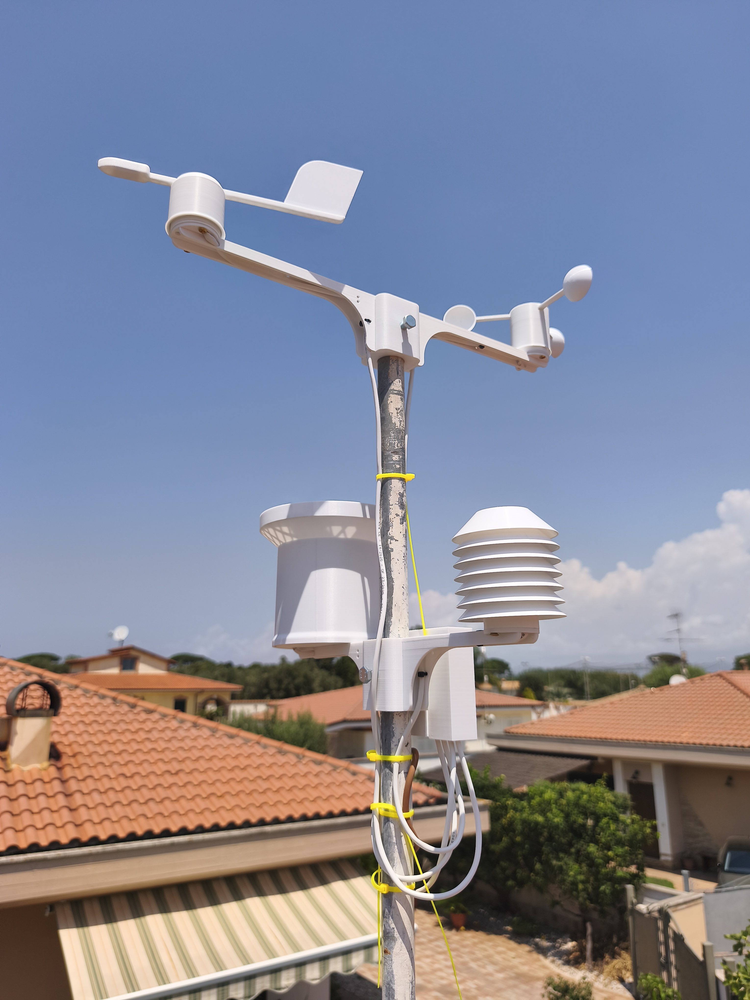
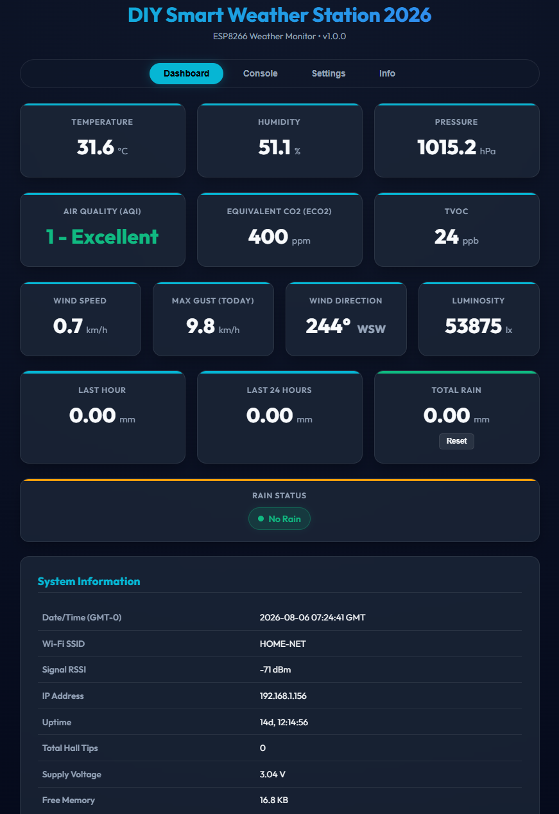

# DIY Smart Weather Station (v1.0.0)

A feature-rich, high-precision ESP8266-based Smart Weather Station with a modern responsive Web Dashboard, dynamic sensor detection, customizable moving-average filters, Home Assistant MQTT Auto-Discovery, full backup/restore capability, and hardware factory reset logic.


---

## 📋 Table of Contents

- [Features](#-features)
- [Photo Gallery](GALLERY.md)
- [Required Hardware](#-required-hardware)
- [Wiring & Pinout](#-wiring--pinout)
- [Web Interface Overview](#-web-interface-overview)
  - [Dashboard](#1-dashboard-tab)
  - [Console](#2-console-tab)
  - [Settings](#3-settings-tab)
  - [Info](#4-info-tab)
- [Settings Page Documentation](#-settings-page-documentation)
- [Home Assistant & MQTT Integration](#-home-assistant--mqtt-integration)
- [Hardware Factory Reset](#-hardware-factory-reset)
- [Backup & Restore](#-backup--restore)
- [Compilation & Flashing](#-compilation--flashing)

---

## ✨ Features

- **Environmental Monitoring**: Temperature, Relative Humidity, Barometric Pressure (sea-level compensated), Air Quality (TVOC, eCO2, AQI), Luminosity (lux), Wind Speed, Wind Gust, Wind Direction, and Rain Gauge (hourly, 24h rolling, and total).
- **Independent Dual-Timer Engine**:
  - Fast, dedicated timer for Anemometer pulse processing (independent of I2C read cycle).
  - Configurable I2C sensor read cycle for environmental data.
- **Configurable Moving Average (Smoothing)**:
  - **Wind Speed**: Ring buffer rolling average with configurable sample count ($N$).
  - **Wind Direction**: Circular mean calculation ($\sin$/$\cos$ vectors) preventing $0^\circ/360^\circ$ boundary glitches across $N$ samples.
  - **Instantaneous Gust Tracking**: Daily wind gust records real peak pulses before averaging.
- **Web UI & Diagnostics**:
  - Glassmorphism dark UI built with HTML5/CSS3/JavaScript (no external dependencies).
  - Tasmota-style live **Debug Console** with interactive command input.
  - Mobile-friendly IP input fields (`inputmode="decimal"`) for easy smartphone setup.
- **Network & WiFi Manager**:
  - Captive Portal AP (`WeatherStation_Setup`) for initial setup.
  - Full DHCP & Static IP configuration support (optimized for FRITZ!Box Mesh networks).
  - Soft-restart clean boot sequence ensuring stable network stack binding.
- **Home Assistant Integration**:
  - Native MQTT Auto-Discovery (`homeassistant/sensor/...`).
  - Automatic entity creation in Home Assistant without manual YAML editing.
- **Backup & Restore**: Single-click JSON export/import including full network, sensor, and MQTT configurations.
- **Hardware Safety & Diagnostics**: 10-second hold on FLASH button (GPIO 0) for NVS memory wipe / factory reset.

---

## 📸 Photo Gallery

Explore the complete build, sensor mounting, electronics enclosure, and web dashboard screenshots in our dedicated **[Photo Gallery (GALLERY.md)](GALLERY.md)**.

Click on any image below or in the gallery to open the full-resolution view!

<table>
  <tr>
    <td align="center" width="33%">
      <a href="images/fully_optionals_smart_wheather_station.jpg"></a><br/>
      <b>Smart Weather Station</b>
    </td>
    <td align="center" width="33%">
      <a href="images/weahet_station_dashboard.png"></a><br/>
      <b>Web Dashboard</b>
    </td>
    <td align="center" width="33%">
      <a href="images/esp%2Bpower%20box.jpg"></a><br/>
      <b>Electronics Box</b>
    </td>
  </tr>
</table>

👉 **[View Full Photo Gallery (30 Photos) ➔](GALLERY.md)**

---

## 🛠 Required Hardware

| Component | Function / Measurement | Interface | Default Address / Pin |
|---|---|---|---|
| **ESP8266 NodeMCU v3** (or ESP-12E) | Main Microcontroller | — | — |
| **AHT20 / AHT21** | Temperature & Relative Humidity | I2C | `0x38` |
| **BMP280** | Barometric Pressure & Temperature | I2C | `0x76` or `0x77` |
| **ENS160** | Air Quality (TVOC, eCO2, AQI) | I2C | `0x53` or `0x52` |
| **AS5600** | Magnetic Rotary Encoder (Wind Direction Vane) | I2C | `0x36` |
| **BH1750** | Ambient Light / Lux Sensor (behind enclosure cover) | I2C | `0x23` |
| **Rain Gauge Bucket** | Tipping Bucket Rain Counter (A3144 Hall / Reed switch) | GPIO Interrupt | GPIO 14 (D5) |
| **Anemometer** | Wind Speed Pulses (Hall / Reed switch) | GPIO Interrupt | GPIO 12 (D6) |
| **FLASH Button** | Factory NVS Wipe (Hold 10 seconds) | GPIO Pull-Up | GPIO 0 (D3) |
| **Status LED** | Onboard Blue LED (WiFi & MQTT status indicator) | Active-LOW Output | GPIO 2 (D4) |

---

## 🔌 Wiring & Pinout

Below is the recommended pin mapping for the ESP8266 NodeMCU board:

```
                  ┌──────────────────────┐
                  │   ESP8266 NodeMCU    │
                  ├──────────────────────┤
        (SDA)  D2 ┤ GPIO 4        GPIO 5 ├ D1  (SCL)
    (Rain ISR) D5 ┤ GPIO 14       GPIO 0 ├ D3  (FLASH Button - Factory Reset)
    (Wind ISR) D6 ┤ GPIO 12       GPIO 2 ├ D4  (Status LED)
                  └──────────────────────┘
```

### I2C Bus Connection (Shared SDA / SCL Pins)

Connect the **SDA** and **SCL** pins of all I2C sensors in parallel to the ESP8266:

| Sensor | Sensor VCC | Sensor GND | SDA Pin | SCL Pin | Notes |
|---|---|---|---|---|---|
| **AHT20 / AHT21** | 3.3V | GND | GPIO 4 (D2) | GPIO 5 (D1) | Address `0x38` |
| **BMP280** | 3.3V | GND | GPIO 4 (D2) | GPIO 5 (D1) | Address `0x76` or `0x77` |
| **ENS160** | 3.3V | GND | GPIO 4 (D2) | GPIO 5 (D1) | Address `0x53` or `0x52` |
| **AS5600** | 3.3V | GND | GPIO 4 (D2) | GPIO 5 (D1) | Address `0x36` |
| **BH1750** | 3.3V | GND | GPIO 4 (D2) | GPIO 5 (D1) | Address `0x23` |

**Note:** On the pressure sensor, remove the 2 resistors on SDA and SCL because when too many sensors are placed in parallel, the value of these resistors drops too much.

**Note:** On the ANS160 sensor, cut the humidity sensor tracks to avoid conflict with the one on the BMP280 sensor (they are on the same address)

<p align="center">
  
</p>

### Pulse / Interrupt Sensors

| Sensor Signal | ESP8266 Pin | Internal Pull-Up | Trigger Mode |
|---|---|---|---|
| **Rain Gauge Signal** | GPIO 14 (D5) | Yes (`INPUT_PULLUP`) | `FALLING` edge |
| **Anemometer Signal** | GPIO 12 (D6) | Yes (`INPUT_PULLUP`) | `FALLING` edge |
| **FLASH Button** | GPIO 0 (D3) | Yes (`INPUT_PULLUP`) | `LOW` when pressed |

---

## 🖥 Web Interface Overview

Access the web portal by visiting `http://<device-ip>` or `http://weatherstation.local` in any modern browser.

### 1. Dashboard Tab
- **Real-Time Cards**: Temperature (°C), Humidity (%), Pressure (hPa), Air Quality (AQI, eCO2 ppm, TVOC ppb), Wind Speed (km/h), Wind Gust (km/h), Wind Direction (° and cardinal points), Luminosity (lx).
- **Rain Monitor**: Last hour rain (mm), Last 24-hour rolling rain (mm), Total cumulative rain (mm) with a manual Reset button.
- **Rain Status Badge**: Dynamic indicator ("No Rain" / "Raining!").
- **System Information Table**: Live NTP synchronized time, Wi-Fi SSID, RSSI, IP address, uptime, total bucket tips, VCC voltage, and free RAM heap.

### 2. Console Tab
- Live streaming log output (Tasmota style).
- Interactive input bar for sending system debug commands (e.g., `help`, `status`).
- One-click log buffer clearing.

### 3. Settings Tab
- Full device configuration form divided into logical sections.
- Integrated **Transmission Calibration Wizard** for PETG luminosity filters.
- One-click **North Direction Calibration** for the AS5600 wind vane.
- Backup & Restore configuration controls.

### 4. Info Tab
- Complete hardware diagnostic summary, firmware version (`v1.0.0`), build details, and active driver states.

---

## ⚙ Settings Page Documentation

Every field on the **Settings** page is detailed below:

### ⚙ General Configuration
- **Hostname (mDNS)**: Device network identifier (default: `WeatherStation`). Accessible at `http://<hostname>.local`.

### 🌧 Rain Gauge Parameters
- **Sensor GPIO (A3144)**: GPIO pin assigned to the rain tipping bucket interrupt (default: `14`).
- **Rain Calibration (mm/tip)**: Millimeters of rain represented by a single bucket tip (default: `0.6314`).
- **Software Debounce (ms)**: Minimum elapsed time required between pulse interrupts to prevent mechanical bounce (default: `300`).

### 🌡 Environmental Sensor Parameters
- **I2C SDA Pin**: GPIO pin assigned to I2C Data (default: `4`).
- **I2C SCL Pin**: GPIO pin assigned to I2C Clock (default: `5`).
- **I2C SCL Clock Speed**: Selectable bus frequency (`50 kHz`, `100 kHz Standard`, `400 kHz Fast`).
- **Altitude (meters)**: Station elevation above sea level in meters used for barometric pressure sea-level adjustment (default: `0`).
- **Temperature Offset (°C)**: Calibration offset applied to temperature readings (e.g., `-1.5`).
- **Humidity Offset (%)**: Calibration offset applied to relative humidity readings.
- **Pressure Offset (hPa)**: Calibration offset applied to barometric pressure readings.
- **Sensor Read Interval (seconds)**: Polling interval for I2C environmental sensors, BH1750, and AS5600 wind direction (default: `5`).

### 💨 Anemometer (Wind) Parameters
- **Sensor GPIO**: GPIO pin assigned to the anemometer pulse interrupt (default: `12`).
- **Anemometer Arm Radius (mm)**: Physical distance from the rotation axis to the center of an anemometer cup (default: `80`).
- **Number of Magnets**: Number of pulses generated per full $360^\circ$ rotation (default: `1`).
- **Aerodynamic Factor (p)**: Ratio between linear wind velocity and cup rotation speed (default: `3.0`).
- **Computed Calibration (km/h per Hz)**: Read-only live field calculated as:
  $$K = \frac{7.2 \times \pi \times \text{Radius (mm)} \times p}{1000 \times \text{Magnets}}$$
- **Software Debounce (ms)**: Interrupt debounce time for wind pulses (default: `15`).
- **Wind Speed Sample Interval (seconds)**: Independent polling interval for counting anemometer pulses (default: `2`).
- **Speed Smoothing (samples, 1–60)**: Number of consecutive samples ($N$) averaged in the rolling speed buffer (default: `5`).
  $$\text{Speed Averaging Window} = N_{\text{speed}} \times \text{Wind Speed Sample Interval}$$
- **Direction Smoothing (samples, 1–60)**: Number of samples ($N$) averaged using circular vector mathematics ($\sin$/$\cos$) (default: `5`).
  $$\text{Direction Averaging Window} = N_{\text{dir}} \times \text{Sensor Read Interval}$$
- **Wind Direction Offset (0–359°)**: Software offset for North alignment. Click **Calibrate North** while pointing the wind vane physically North to automatically store the offset.

### 💡 Luminosity Calibration (BH1750 behind PETG)
- **Transmission Calibration Factor (0.01 – 1.0)**: Light transmission ratio through the PETG enclosure cover (default: `1.0`).
- **Guided Transmission Calibration Wizard**:
  1. **Step 1**: Expose BH1750 directly to a constant light source without cover, then click **Read Unfiltered**.
  2. **Step 2**: Place the PETG cover back over the sensor under the same light source, then click **Read Filtered**. The calibration factor is calculated automatically.

### 🌐 Network Configuration
- **Use DHCP**: Toggle between automatic IP assignment (DHCP) and Static IP mode.
- **Static IP / Gateway / Netmask**: Network IP settings (recommended when operating behind FRITZ!Box Mesh repeaters).
- **Primary / Secondary DNS**: Domain Name System servers (default: `8.8.8.8` / `8.8.4.4`).
- **NTP Server**: Network Time Protocol server for clock synchronization (default: `pool.ntp.org`).

### 🩺 Crash Diagnostics
- **Send crash dump**: Enables automated diagnostic crash reports upon system panic or unexpected watchdog resets.

### 📡 MQTT Broker
- **MQTT Server / Port**: IP address or hostname and port of your MQTT broker (e.g., Home Assistant Mosquitto on `192.168.1.50:1883`).
- **MQTT User / Password**: Authentication credentials.
- **MQTT Publish Interval (seconds)**: Telemetry publishing interval (default: `15`).
- **MQTT Decimal Places**: Decimal rounding for published sensor payloads (`0`, `1`, or `2`).

---

## 🏡 Home Assistant & MQTT Integration

### Auto-Discovery
When configured with a valid MQTT broker, the weather station automatically publishes Home Assistant MQTT Discovery configuration messages under:
```
homeassistant/sensor/<hostname>_<sensor>/config
homeassistant/binary_sensor/<hostname>_is_raining/config
```

All entities are automatically grouped under a single Home Assistant Device named **WeatherStation** (or your custom hostname).

### Telemetry Topics
- **Telemetry Payload**: Published to `tele/<hostname>/SENSOR`
- **Last Will & Testament (LWT)**: Published to `tele/<hostname>/LWT` (`Online` / `Offline`)

### Example JSON Payload (`tele/WeatherStation/SENSOR`)
```json
{
  "uptime": 8420,
  "heap": 24150,
  "tips": 14,
  "total_rain_mm": 8.84,
  "hourly_rain_mm": 1.26,
  "daily_rain_mm": 3.78,
  "is_raining": false,
  "rssi": -62,
  "ip": "192.168.1.150",
  "temperature": 22.4,
  "humidity": 55.1,
  "pressure": 1014.2,
  "tvoc": 45,
  "eco2": 412,
  "aqi": 1,
  "lux": 1420.5,
  "wind_speed": 12.4,
  "wind_gust": 24.8,
  "wind_direction": 184.5
}
```

---

## 🔘 Hardware Factory Reset

If you lose access to the web portal or misconfigure the network settings, you can wipe the internal NVS flash storage without reflashing firmware:

1. **Press and hold** the **FLASH button** (GPIO 0 / D3) on the NodeMCU board.
2. Hold it down for **10 continuous seconds**.
3. The onboard blue LED will flash rapidly and the console will output:
   `[System] Factory Reset triggered via FLASH button!`
4. All stored settings will be erased, and the ESP8266 will reboot automatically into Access Point captive portal mode (`WeatherStation_Setup`).

---

## 💾 Backup & Restore

### Downloading Backup
1. Navigate to **Settings** $\rightarrow$ **Backup & Restore Settings**.
2. Click **Download Backup**.
3. A JSON file named `<hostname>_config_YYYY-MM-DD.json` will download immediately, containing all sensor parameters, offsets, network choices, static IP values, and stored WiFi credentials.

### Restoring Backup
1. Click **Restore Backup** and select your saved `.json` file.
2. Confirm the prompt.
3. Settings will be restored to NVS flash and the station will reboot automatically within 8 seconds.

---

## 📦 Compilation & Flashing

This project is built using [PlatformIO](https://platformio.org/).

### Prerequisites
- Visual Studio Code with PlatformIO IDE extension installed.

### PlatformIO Configuration (`platformio.ini`)
```ini
[env:nodemcuv2]
platform = espressif8266
board = nodemcuv2
framework = arduino
monitor_speed = 115200
board_build.flash_mode = dout
lib_deps =
    bblanchon/ArduinoJson@^7.0.0
    knolleary/PubSubClient@^2.8
    adafruit/Adafruit AHTX0@^2.0.5
    adafruit/Adafruit BMP280 Library@^2.6.8
    https://github.com/tzapu/WiFiManager.git
```

### Building & Uploading
```bash
# Build firmware
pio run

# Upload to ESP8266 via USB (COM port)
pio run --target upload

# Open Serial Monitor
pio device monitor -b 115200
```

---

## 📄 License & Credits

- **Author**: PeppeBytes
- **Firmware Version**: v1.0.0 (Release 2026)
- **License**: MIT License
